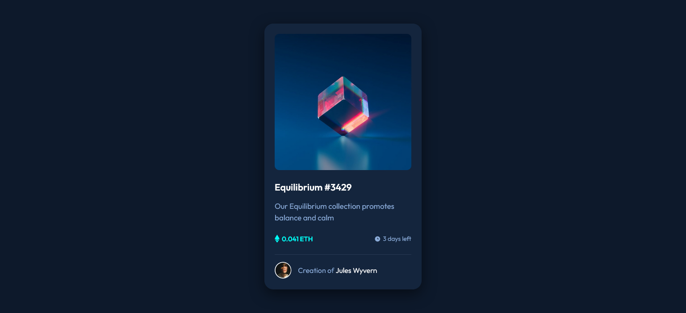
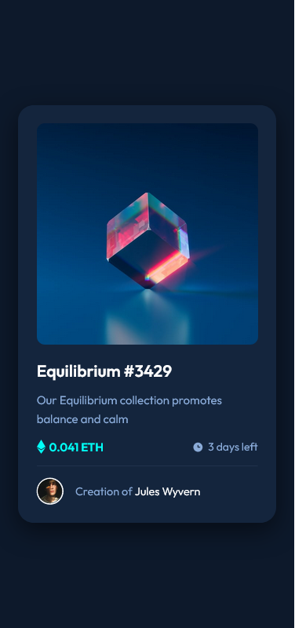

# Frontend Mentor - NFT preview card component solution
This is a solution to the [NFT preview card component](https://www.frontendmentor.io/challenges/nft-preview-card-component-SbdUL_w0U). The challanges at [Frontend Mentor](#frontendmentor.io) helps you improve your frontend skills by building realistic projects.

## Table of contents

- [Overview](#overview)
  - [The challange](#the-challange)
  - [Build with](#build-with)
  - [Screenshots](#screenshots)
    - [Desktop view](#desktop-view)
    - [Mobile view](#mobile-view)
- [Links](#links)

## Overview

### The challange

Users should be able to:

- View the optimal layout depending on their device's screen size
- See hover states for interactive elements

### Build with

- HTML5
- SASS

## Screenshots

### Desktop viewc

### Mobile view

## Links

- Live Site URL: (https://md-talim.github.io/NFT-preview-card-component)